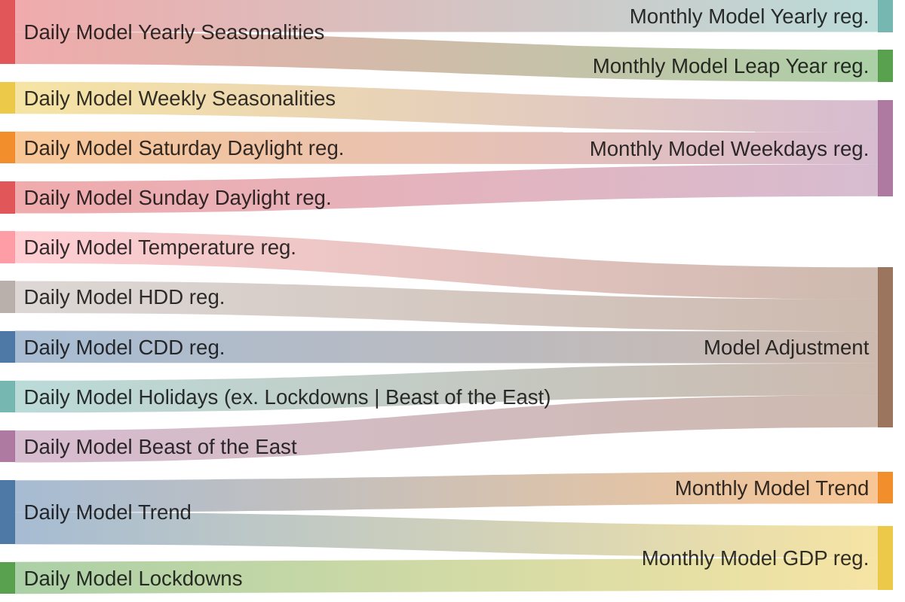

\
**The monthly model is going to have a different trend as we are:**
1. Removing the effect of weather and holidays (**external independent variables**) so we can forecast on data that is "unchanged" due to weather and holidays.
2. Adding a new variable on top of the "residual Daily Model variables" (All but weather + holidays), which is GDP.
3. GDP accounts for what was measured by "Lockdowns" in the Daily Model + signals that are not caught by the Daily Model.
  
So, what we are taking out from the Daily Model are all the variables that affect the demand that are not being caught by the Monthly Model.

We could also take out all the Daily Model variables related to the Monthly Model "Weekdays" regressor, and also this Monthly Model regressor. After that, we'd need to add these weights back to the outputs of the new Monthly Model.
